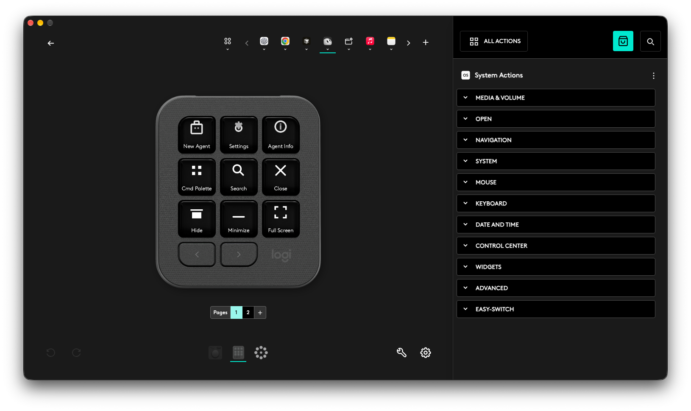

# Logi MX Creative Keypad — Application Profiles

*Example: Grok Bot profile (page 1) after import — custom icons and labels on the keypad keys.*

Ready-to-import **Logi Options+** profiles (`.lp5`) for the [MX Creative Keypad](https://www.logitech.com/), with custom monochrome key icons.

These were built for macOS. Import them in **Logi Options+** (2.07+ recommended). No personal account data is embedded — only app bundle IDs, shortcut labels, key mappings, and SVG icons.

## Quick start

1. Install [Logi Options+](https://www.logitech.com/software/logi-options-plus.html) and connect the keypad.
2. Open Options+ → your MX Creative Keypad → **Profiles** / application list.
3. Import a file from [`profiles/`](profiles/) (drag-and-drop or the import control, depending on Options+ version).
4. Focus the matching app and smoke-test the keys. Remap anything that conflicts with your own shortcuts.

## Profiles included

| Profile | App (bundle ID) | What the keys do |
| --- | --- | --- |
| [ChatGPT Profile_18keys.lp5](profiles/ChatGPT%20Profile_18keys.lp5) | ChatGPT / Codex (`com.openai.codex`) | Chat bar, new/temporary/quick chat, voice, dictation, command menu, sidebar, find, chat nav, model picker, pin/archive, settings, Codex panel/terminal |
| [Cursor Profile_18keys.lp5](profiles/Cursor%20Profile_18keys.lp5) | Cursor (`com.todesktop.230313mzl4w4u92`) | Sidepanel, agent layout/modes, model loop, voice, command palette, new chat, cancel gen, inline edit, add to chat, chat nav, settings, force send |
| [Grok Bot Profile_18keys.lp5](profiles/Grok%20Bot%20Profile_18keys.lp5) | Grok Bot (`com.anysphere.sand`) | New agent, settings, agent info, command palette, search, window controls, then standard edit/zoom keys on page 2 |
| [Google Chrome Profile_18keys.lp5](profiles/Google%20Chrome%20Profile_18keys.lp5) | Google Chrome (`com.google.Chrome`) | Tabs/windows, incognito, address bar, find, reload/hard reload, downloads, history, bookmarks bar, DevTools, zoom, fullscreen |
| [Photos Profile_18keys.lp5](profiles/Photos%20Profile_18keys.lp5) | Photos (`com.apple.Photos`) | Import, album, favorite/hide, edit/crop, zoom, slideshow, share, find |
| [Notes Profile_18keys.lp5](profiles/Notes%20Profile_18keys.lp5) | Notes (`com.apple.Notes`) | New note/folder, checklist/table, typography, find, pin, attachments |
| [Shortcuts Profile_18keys.lp5](profiles/Shortcuts%20Profile_18keys.lp5) | Shortcuts (`com.apple.shortcuts`) | New shortcut/folder, run, gallery/list, clipboard, find |
| [Siri AI Profile_18keys.lp5](profiles/Siri%20AI%20Profile_18keys.lp5) | Siri AI (`com.apple.campo`) | New chat, settings, find, window + edit/zoom, dictation/stop — thinner set; verify after import |
| [Xcode Profile_18keys.lp5](profiles/Xcode%20Profile_18keys.lp5) | Xcode (`com.apple.dt.Xcode`) | Run/build/stop/test/clean, quick open, find, navigator/debug/inspectors, fold/comment, library, command palette |
| [MagicaVoxel Profile_18keys.lp5](profiles/MagicaVoxel%20Profile_18keys.lp5) | MagicaVoxel (`EPH.MagicaVoxel`) | Save/open, attach/erase/paint/move, modes, camera/grid/mirror — smoke-test; app path may need Options+ to see `MagicaVoxel.app` |
| [Apple TV Profile_18keys.lp5](profiles/Apple%20TV%20Profile_18keys.lp5) | TV (`com.apple.TV`) | Playback, skip, volume, library/store, subtitles, speed |
| [Apple Music Profile_18keys.lp5](profiles/Apple%20Music%20Profile_18keys.lp5) | Music (`com.apple.Music`) | Play/pause, tracks, volume, shuffle/repeat, mini player, library |

Full per-key shortcut tables: [PROFILES.md](PROFILES.md).

## How these were created

There are no official Options+ plugins for ChatGPT, Cursor, or Grok Bot. Native Logitech app plugins also do not cover this custom keypad layout the way we needed, so profiles were built as **generic keyboard-shortcut actions** bound to each app’s bundle ID.

### Format

An `.lp5` file is a **ZIP** of JSON (not a proprietary binary blob):

- `ApplicationInfo.json` — app display name + `processOrBundleName` (bundle ID)
- `ProfileInfo.json` — layout (2×9 keys), actions of type `$@Generic___@KeyboardKey`, and metadata
- `ActionIcons/*.ict` — per-key icon packages (dark background + embedded **32×32 SVG** + label text)
- `metadata/` — preview / advanced info

### Build steps

1. **Seed export** — Started from a ChatGPT profile exported from Options+ on a Mac after mapping the first set of keys in the UI (Options+ itself is Electron and awkward to automate).
2. **Decode** — Unzipped the `.lp5`, documented the `keyboardKey` string format (human label + layout + mac keycode + modifier flags, delimited with `#¤%&+?`).
3. **Clone per app** — Copied the profile skeleton, swapped `ApplicationInfo` / `ProfileInfo` application fields to each target bundle ID, and rewrote the 18 `keyboardKey` parameters to that app’s Mac shortcuts.
4. **Icons** — Drew a small library of monochrome SVGs (Logi-like light gray on dark). Each action’s `.ict` embeds a purpose-matched SVG (e.g. new-tab, find, reload) plus the display label — so you do not have to pick library icons one key at a time in Options+.
5. **Repack** — Zipped the folder tree back to `*.lp5` for import.

Source SVGs used for the icons live in [`icons/`](icons/).

### Caveats

- **Ctrl / uncommon chords** and some MagicaVoxel / Siri AI / Music bindings may need a quick remap after import if your locale or app version differs.
- MagicaVoxel attaches when Options+ can see the app (often under `~/Applications/MagicaVoxel/...`).
- Profile preview images inside the package may look stale until Options+ regenerates them; the live key icons come from the `.ict` files.
- These profiles contain **no** name, email, home path, or account data — safe to fork and share.

## License

Profiles and icons: [MIT](LICENSE). Logitech, Loupedeck, and app names are trademarks of their owners; this repo is unofficial and not affiliated with Logitech or the app vendors.
